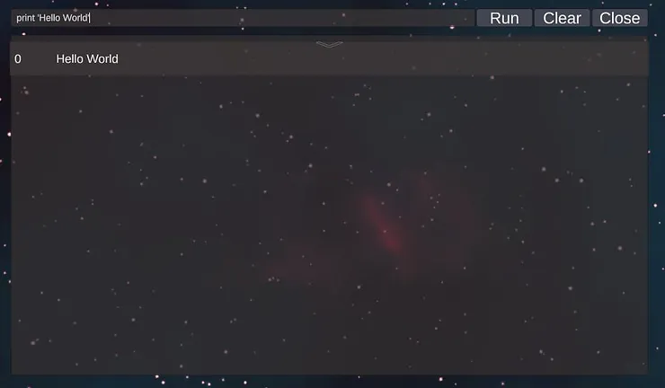
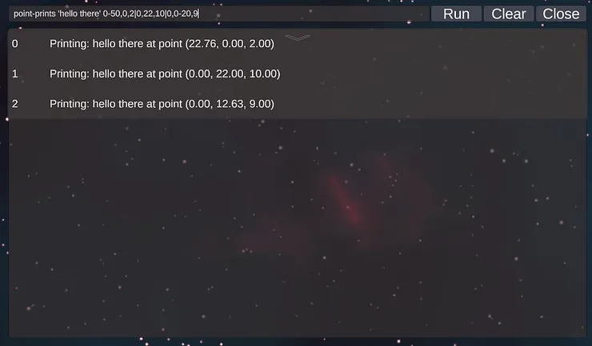
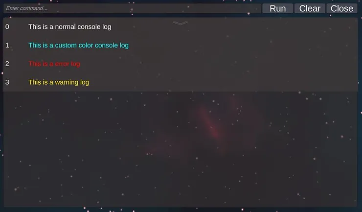

Unity asset link: https://assetstore.unity.com/packages/tools/game-toolkits/commandline-237325


# Command Line Tool for Unity

## What is the Command Line Tool?

The command line tool enables developers to easily create or convert existing methods into command line arguments. This makes it a powerful tool for **debugging** or **creating an admin command system**.

---

## How It Works

In the code snippet below, you will notice an attribute called `[Command("print")]`. The **string inside the attribute defines the name of the command** used in the command line to reference the method.

⚠ **Important:**  
Ensure that the **command line component is present and active** in your scene, as commands will only execute if the component is active.

### Example:

```csharp
public void ConsoleLog(object content)
{
    var textLog = SpawnTextLog();
    textLog.textarea.text = content.ToString();
}

[Command("print")]
private void Log(string text)
{
    ConsoleLog(text);
}
```

In this example:

- The `ConsoleLog` method **displays text in the console**.
- The `[Command("print")]` attribute **binds the Log method to the command line**.
- The `Log` method takes a string argument and passes it to `ConsoleLog`, effectively printing it.

---

## Default Command Support

The `print` command is included by default in the **command line package**, along with a **default command line UI**, as shown below.



---


Note that single quotes that surrounding the 'Hello World' text. The commandline required center symbols or pattern to determine its type. Let us have a look at all the types you might face and the corresponding commandline representations.


| Type       | CommandLine Representation Example | Requires Special Symbols | Description |
|------------|-----------------------------------|--------------------------|-------------|
| number     | 0                                 | NO                       | Type number includes type int, float, and double. |
| string     | 'hello world'                     | YES                      | Everything between single quotes is considered a string. |
| Vector2    | 0,0                               | YES                      | Two commas are required to represent the separation between the x and y values. |
| Vector3    | 0,0,0                             | YES                      | Three commas are required to represent the separation between the x, y, and z values. |
| Quaternions | 0,0,0,0                           | YES                      | Four commas are required to represent the separation between the x, y, z, and w values. |
| Random     | 1-49                              | YES                      | Values placed between a dash symbol will create a random number based on the range given, where the left side represents the min value and the right side represents the max value. |
| Array or List | 15\|20                         | YES                      | All types above can be placed in an array or list by placing them between the straight line symbol. |


# Using the Command Line in Play Mode

In this guide, we will explore how to use the command line system to print text at random points in a scene. We'll break down how to define and use a custom command with specific argument types.

## Creating a Method with Command Attributes

First, we create a method that accepts a string and an array of `Vector3` values. Then, we bind it to a command named `point-prints` using the `[Command]` attribute.

```csharp
[Command("point-prints")]
private void LogAtPoints(string text, Vector3[] points)
{
    foreach (var point in points)
    {
        ConsoleLog($"Printing: {text} at point {point.ToString()}");
    }
}
```

### Breaking Down the Command

Example command usage:

```plaintext
point-prints 'hello there' 0-50,0,2|0,22,10|0,0-20,9
```

Each argument is separated by a space:

- **`point-prints`**: The name of the command linked to our method.
- **`'hello there'`**: A string argument matching the method’s parameter.
- **`0-50,0,2|0,22,10|0,0-20,9`**: A list (array) of `Vector3` values matching the method’s parameter.  
  - The first element has a **random x-value** (`0-50`).
  - The third element has a **random y-value** (`0-20`).

---

## How to Open the Default Command Line in Play Mode

After adding the **command line prefab** to the scene, you can open or close it by pressing the **TAB** key.

### How to Use the Default Command Line

The default command line can be found at:

```
Assets > CommandLine > Prefabs
```

Look for a prefab named **CommandLine** and drag it into your scene.

---

## Controls

| Key / Action     | Function |
|------------------|----------|
| **Tab**         | Opens or closes the command line. |
| **Arrow Up**    | Cycles upward through previously typed commands. |
| **Arrow Down**  | Cycles downward through previously typed commands. |
| **Drag Mouse**  | Click and drag the left mouse button to scroll through the output logs. |
| **Enter**       | Executes the entered command. |
| **Run Button**  | Executes the entered command. |
| **Clear Button** | Clears all logs. |
| **Close Button** | Closes the console. |
| **Drop-Down Arrow** | Shows or hides the log section. |

---

## How to Print to the Default Console

The default console supports the `print` command, as mentioned in a previous blog post.

⚠ **Note:** The `point-prints` command does not exist in the default command line.

### Logging to the Console

The default command line exposes public methods for logging messages:

```csharp
_commandLineUI.ConsoleLog("This is a normal console log");

_commandLineUI.ConsoleLog("This is a custom color console log", Color.cyan);

_commandLineUI.ConsoleLogError("This is an error log");

_commandLineUI.ConsoleLogWarning("This is a warning log");
```



🚨 **When a command fails to execute, an error log will be displayed in the console.**

---

## How to Add the Command Line to a Custom UI

The command line system is designed as a **singleton**. To use it in a custom UI, ensure the component is present in the scene and not disabled. Then, add this line to your script:

```csharp
CommandLine.Instance.RunCommand(text);
```

---

## Conclusion

After reading this guide, we hope you find this tool helpful for your project. This version of the command line is **free and open-source**, available on the **Unity Asset Store** and **GitHub**.

